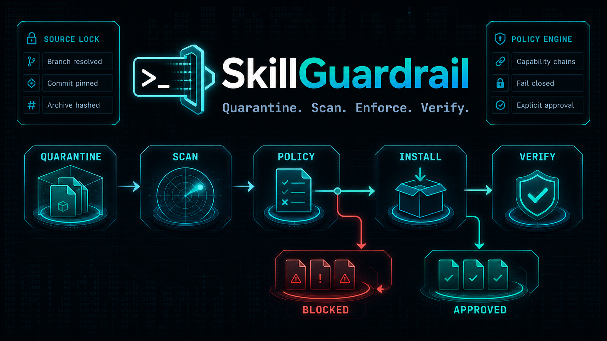

<h1 align="center">SkillGuardrail</h1>

<p align="center">
  <a href="README.md">English</a> · 简体中文
</p>

<p align="center">
  <a href="https://github.com/T-Zevin/SkillGuardrail/actions/workflows/ci.yml"></a>
  <a href="https://github.com/T-Zevin/SkillGuardrail/releases"></a>
  <a href="https://github.com/T-Zevin/SkillGuardrail/releases"></a>
  <a href="go.mod"></a>
  <a href="LICENSE"></a>
  <a href="#平台支持"></a>
  <a href="https://github.com/T-Zevin/SkillGuardrail/commits/main"></a>
</p>



**在 Agent 读取之前先扫描，只安装你真正信任的 Skill。**

SkillGuardrail 是一个开源的 Agent Skills 安装前安全扫描器和受控安装工具。它把公开 GitHub 包下载到私有隔离区，并把本地目录复制成有资源上限的私有快照；完成确定性静态检查、能力推断和策略判定，得到明确批准后才写入 Codex、Claude Code、Cursor、Gemini CLI 或 OpenClaw 的 Skill 目录。

> SkillGuardrail 只能降低风险，不能证明一个 Skill 绝对安全。请继续使用最小权限、Agent 沙箱和人工复核。

| **先隔离** | **不止打分，更能执行策略** | **安装结果可验证** |
|:---|:---|:---|
| 在不运行包内代码的前提下检查不可信 Skill。 | 将风险发现与能力链转化为明确、可执行的判定。 | 用来源 commit、内容指纹和外部 receipt 绑定安装结果。 |

## 目录

- [核心区别](#核心区别)
- [安装](#安装)
  - [平台支持](#平台支持)
- [使用](#使用)
- [判定与退出码](#判定与退出码)
- [相关工作](#相关工作)
- [许可证](#许可证)

## 核心区别

它不只是输出一份扫描分数，还覆盖完整安装事务：

```text
不可信来源 → 隔离获取 → 静态扫描 → 风险判定 → 明确批准
                                              ↓
                                  原子安装 + 文件级 receipt
                                              ↓
                                         后续篡改验证
```

- GitHub 可变分支先解析成不可变 commit；
- 仅从 GitHub 官方 API 和 codeload 获取公开仓库；
- 安全解包，拒绝路径穿越、软硬链接、特殊文件、大小写碰撞和压缩炸弹；
- 扫描过程中不执行 Skill 脚本、解释器、包管理器或安装钩子；
- 检查 Prompt Injection、敏感凭据访问、外传、危险命令、持久化、混淆、二进制和供应链风险；
- 安装前再次扫描 staging 内容，随后在同一文件系统原子切换；
- 权威 receipt 保存在 Skill 目录之外的私有状态目录，并绑定规范化安装路径；包内 `.skillguardrail.lock` 只是便于查看的镜像，不能给自己背书；
- receipt 记录来源 commit、归档哈希、包指纹、条目类型与权限、逐文件 SHA-256、风险发现和能力清单；
- `verify` 可以发现安装后的新增、删除和修改。

## 安装

使用 Go 1.23 或更高版本：

```bash
go install github.com/T-Zevin/SkillGuardrail/cmd/skillguardrail@latest
```

通过该方式安装时，工具版本来自 Go 模块构建信息；官方 Release 归档还会写入标签对应的提交和构建时间。

发布版本可从 [GitHub Releases](https://github.com/T-Zevin/SkillGuardrail/releases) 下载，并使用 `checksums.txt` 校验。

Homebrew Release 工作流已经就绪；创建 `T-Zevin/homebrew-tap` 并配置发布令牌后可使用：

```bash
brew install T-Zevin/tap/skillguardrail
```

### 平台支持

macOS、Linux 和 Windows 均支持扫描及报告输出。受控 `install` 和 `verify` 初版仅在 macOS 与 Linux 启用：除普通权限位外，工具还会清除并验证扩展 ACL/POSIX ACL；如果文件系统无法证明 ACL 不存在，也会默认拒绝。其他平台不会启用受控操作，但 Windows 用户仍可先扫描，再手动安装已复核文件。

macOS 上的受控操作只会为 ACL 处理调用固定系统工具 `/bin/chmod` 和 `/bin/ls`，不会调用 Skill 自带的可执行文件、脚本、解释器或安装钩子。

## 使用

扫描本地 Skill：

```bash
skillguardrail scan ./my-skill
```

扫描公开 GitHub 仓库：

```bash
skillguardrail scan https://github.com/example/useful-skill
```

输出 JSON 或 SARIF：

```bash
skillguardrail scan ./my-skill --format json
skillguardrail scan ./my-skill --format sarif --output skillguardrail.sarif
```

扫描通过后安装到 Codex：

```bash
skillguardrail install https://github.com/example/useful-skill --target codex --yes
```

目标目录和权威状态根目录必须归当前用户所有，且不能让其他用户写入。自定义 `--state-dir` 在 Unix 上应使用 `0700` 权限。使用 `--replace` 时，旧 Skill 会保存在唯一的私有备份目录，成功后命令会输出具体路径。

验证已安装内容是否变化：

```bash
skillguardrail verify my-skill --target codex
skillguardrail verify ~/.codex/skills/my-skill
```

默认权威 receipt 位于当前用户的 SkillGuardrail 配置状态目录。受控操作会验证目录所有者与父目录替换边界，并拒绝未清除的文件系统 ACL，避免出现 receipt 未记录的额外访问权限。备份或自动化场景可通过 `SKILLGUARDRAIL_STATE_HOME` 或安装、验证命令的 `--state-dir` 指定其他位置，但它必须保持私有并位于 Agent 的 Skill 发现目录之外。该机制用于发现本地漂移，并不是发布者签名；若同一用户权限下的进程可以同时改写 Skill 和外部状态目录，它仍可伪造本地历史。

初版远程源只支持公开 GitHub HTTPS 仓库，并要求仓库根目录对应一个可移植 Skill。

## 判定与退出码

| 判定 | 默认行为 |
| --- | --- |
| `pass` | 未发现阻断信号，可继续 |
| `review` | 存在 Medium 风险，需要明确决定 |
| `block` | 存在 High 风险或累计风险达到阈值，禁止安装 |
| `critical` | 关键行为链或安全边界破坏，禁止覆盖 |

| 退出码 | 含义 |
| ---: | --- |
| `0` | 策略允许或命令成功 |
| `1` | 需要复核或策略拒绝 |
| `2` | 参数、获取、解析、扫描或 I/O 失败，结果不完整 |
| `3` | 操作取消或缺少明确的 `--yes` |

规则目录见 [docs/rules.md](docs/rules.md)，安全边界与已知限制见 [docs/threat-model.md](docs/threat-model.md)。

## 相关工作

项目设计参考了 [NVIDIA SkillSpector](https://github.com/NVIDIA/SkillSpector)、[Cisco AI Defense Skill Scanner](https://github.com/cisco-ai-defense/skill-scanner)、[Agent Skills 规范](https://agentskills.io/specification)和 [OWASP Agentic Skills Top 10](https://owasp.org/www-project-agentic-skills-top-10/)，代码与安全安装事务为独立实现，不代表上述项目对 SkillGuardrail 的认证或背书。

## 许可证

[Apache License 2.0](LICENSE)
